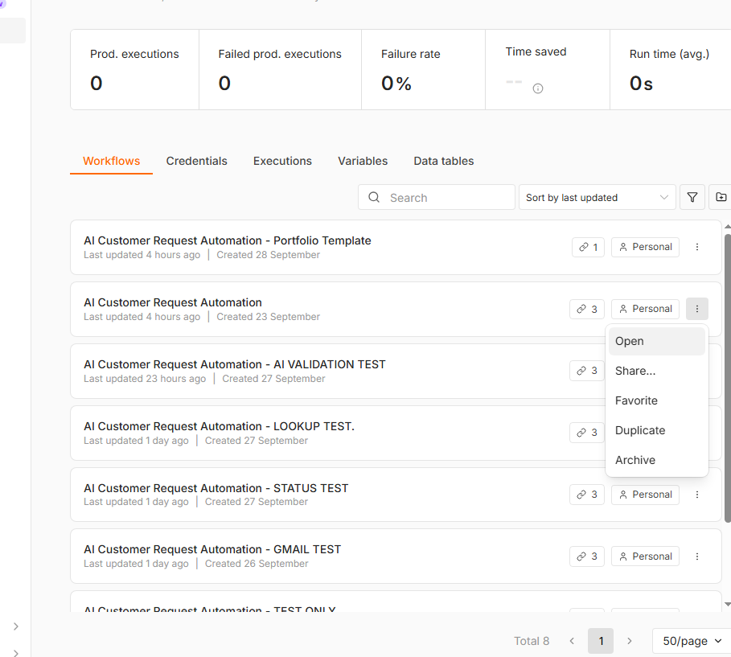

# AI Customer Request Automation (n8n)

An end-to-end n8n workflow that receives customer requests through a form, validates the input, rejects duplicates, classifies requests with Google Gemini, stores structured results in Google Sheets, and sends an internal Gmail notification.

This repository contains a sanitized portfolio template. It does not include credentials, API keys, personal email addresses, spreadsheet IDs, execution data, or customer records.



## Key Features

- Customer request form with required name, email, and request fields
- Input validation before any external API call
- Duplicate detection using email and request text
- AI classification into `Billing`, `Technical Support`, `Sales`, or `Other`
- Priority assignment: `Low`, `Medium`, or `High`
- Short AI-generated English summary
- Structured Google Sheets storage
- Internal Gmail notification
- Notification delivery status tracking
- Separate user-facing responses for validation, duplicate, AI, lookup, storage, notification, and status-update outcomes

## Workflow

```text
Form submission
  -> Input validation
  -> Duplicate lookup
  -> Gemini classification and response validation
  -> Structured field mapping
  -> Google Sheets append
  -> Gmail notification
  -> Google Sheets notification-status update
  -> User-facing completion screen
```

## Repository Structure

```text
.
├── docs/
│   └── workflow-overview.png
├── workflow/
│   └── ai-customer-request-automation.json
├── .gitignore
└── README.md
```

## Requirements

- n8n with the Google Gemini node available
- Google Gemini API credential
- Google Sheets OAuth2 credential
- Gmail OAuth2 credential
- A Google Sheet with a tab named `Requests`

## Google Sheets Schema

Create these columns in the `Requests` sheet:

| Column | Purpose |
| --- | --- |
| `full_name` | Customer name |
| `email` | Customer email |
| `request` | Original request text |
| `category` | AI-assigned category |
| `priority` | AI-assigned priority |
| `summary` | AI-generated summary |
| `submitted_at` | Form submission timestamp |
| `notification_status` | `pending` or `sent` |
| `request_id` | n8n execution ID used for status updates |

## Setup

1. Import `workflow/ai-customer-request-automation.json` into n8n.
2. Create or select credentials for Google Gemini, Google Sheets, and Gmail.
3. Replace every `REPLACE_WITH_YOUR_SPREADSHEET_ID` value with your spreadsheet ID.
4. Replace `REPLACE_WITH_YOUR_NOTIFICATION_EMAIL` with the internal notification address.
5. Confirm that the sheet tab is named `Requests` and contains the columns listed above.
6. Select your credentials in the relevant nodes.
7. Run the workflow manually and test all branches before publishing it.

## Suggested Test Cases

- Valid billing request
- Valid technical request with urgent business impact
- Valid sales question
- Empty or whitespace-only name
- Invalid email address
- Request shorter than 10 characters
- Exact duplicate request
- Same email with a different request
- Gemini/API failure
- Google Sheets lookup or append failure
- Gmail delivery failure

## Security Notes

- Never commit credentials, tokens, OAuth client secrets, customer data, execution exports, or real spreadsheet IDs.
- Use your own n8n credentials after import.
- Treat customer request text as untrusted data.
- Restrict spreadsheet and Gmail permissions to the minimum required scope.
- Review retention, privacy, and access-control requirements before production use.

## Portfolio Scope

This project demonstrates workflow design, validation, duplicate handling, structured LLM output, Google Workspace integration, status tracking, and graceful error paths. It is a portfolio/demo implementation and should be reviewed and hardened for a specific production environment.

## Copyright and Usage

Copyright © 2026 Sergey. All rights reserved.

This repository is provided for portfolio review only. Reuse, redistribution, modification, publication, or commercial use is not permitted without the copyright holder's prior written permission. No open-source license is granted.
